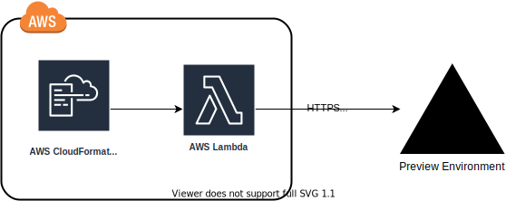

# Vercel Secret Forwarder

A Cloudformation custom resource that can be used to forward the output from stacks to a vercel deployment

- [Vercel Secret Forwarder](#vercel-secret-forwarder)
  - [Features](#features)
  - [Example](#example)

## Features

- Returns the preview url statically to use in other dependant resources
- Set secrets to be sent from the AWS Account deploying the CDK cloudformation, directly to Vercel, via HTTPS API
- Returns a function to bind in secrets to set in the custom resource





## Example

A full example can be found here, which utilizes serverless stack to deploy a cognito pool, and send the required credentials to the vercel preview deploy.

```ts
// ./../../../examples/latest/lib/MyStack.ts

import * as sst from '@serverless-stack/resources';
import { performance } from 'perf_hooks';
import { VercelSecretSyncConstruct } from '@cdk-utils/vercel-secret-forwarder';
import { OAuthScope } from '@aws-cdk/aws-cognito';

export default class MyStack extends sst.Stack {
  constructor(scope: sst.App, id: string, props?: sst.StackProps) {
    super(scope, id, props);

    const vercelConfiguration = {
      VercelProjectId: String(process.env.VERCEL_PROJECT_ID),
      VercelProjectName: String(process.env.VERCEL_PROJECT_NAME),
      VercelProjectOrganisation: String(process.env.VERCEL_ORGANISATION_NAME),
      GitBranch: String(process.env.GIT_BRANCH),
      VercelAuthToken: String(process.env.VERCEL_AUTH_TOKEN),
    };

    const vercel = new VercelSecretSyncConstruct(this, 'SendSecretsToVercel', {
      VercelEnvironmentVariables: {
        NEXT_PUBLIC_LOCAL_TEST: 'Preview domain',
        PRIVATE_TEST: 'This is a test one',
        NEXT_PUBLIC_UPDATED_TIMESTAMP_TEST: String(performance.now()),
      },
      ...vercelConfiguration,
    });

    const auth = new sst.Auth(this, 'AuthBase', {
      cognito: {
        userPool: {
          signInAliases: {
            email: true,
            username: true,
          },
        },
        userPoolClient: {
          oAuth: {
            scopes: [OAuthScope.PHONE, OAuthScope.EMAIL, OAuthScope.OPENID],
            // Use the preview url constructor, to deploy OAuth callback urls
            callbackUrls: [`${vercel.previewUrl}`],
            logoutUrls: [vercel.previewUrl],
          },
        },
      },
    });

    // Hook in to add a secret, to a dependency that is only known at deploy
    // time. You can export vercel as readonly, and use it across stack
    vercel.addSecret(
      'NEXT_PUBLIC_COGNITO_USER_POOL_ID',
      auth.cognitoUserPool?.userPoolId as string
    );
  }
}

```
